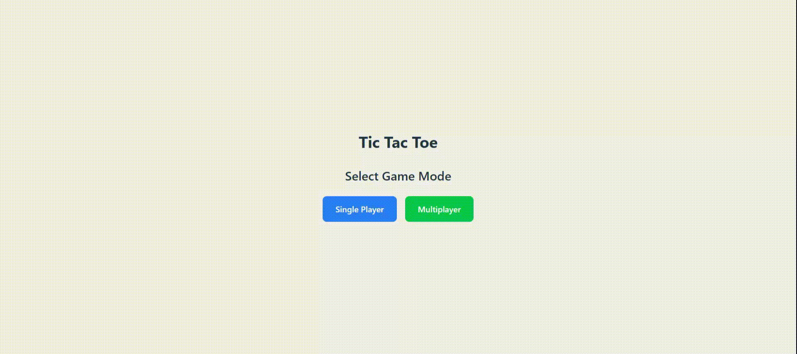

# Tic-Tac-Toe

Tic-Tac-Toe game built with React + TypeScript + Vite.

## Preview




## About The Project

This is a fully-functional Tic Tac Toe game with the following features:

- **Multiple Game Modes**: Play against a friend or challenge the AI
- **Difficulty Levels**: Choose from Easy, Medium, or Hard AI opponents


The AI in Hard mode uses the Minimax algorithm with Alpha-Beta pruning to make optimal moves, making it almost unbeatable!

## Built With

- [React](https://reactjs.org/) - UI library
- [TypeScript](https://www.typescriptlang.org/) - Type safety
- [Vite](https://vitejs.dev/) - Build tool and development server
- [Tailwind CSS](https://tailwindcss.com/) - Utility-first CSS framework

## Getting Started

Follow these simple steps to get a local copy up and running:

### Prerequisites

- Node.js (version 16.x or later)
- npm or yarn

### Installation

1. Clone the repository
   ```sh
   git clone https://github.com/jjteoh-thewebdev/react-tic-tac-toe.git
   ```

2. Navigate to the project directory
   ```sh
   cd react-tic-tac-toe
   ```

3. Install dependencies
   ```sh
   npm install
   ```

4. Start the development server
   ```sh
   npm run dev
   ```

5. Open your browser and navigate to `http://localhost:5173`

### Build for Production

To create a production build:

```sh
npm run build
```

The build artifacts will be located in the `dist/` directory.

## License

Distributed under the MIT License. See `LICENSE` file for more information.

## Contact

Your Name - [thewebdev.jjteoh@gmail.com](mailto:thewebdev.jjteoh@gmail.com)

Project Link: [https://github.com/jjteoh-thewebdev/react-tic-tac-toe](https://github.com/jjteoh-thewebdev/react-tic-tac-toe)
